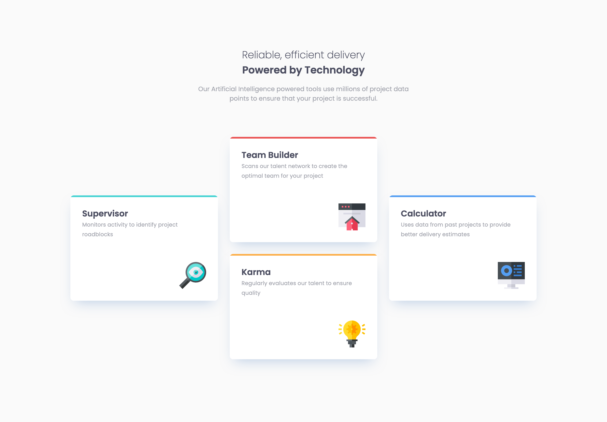

# Frontend Mentor - Stats preview card component solution

This is a solution to the [Four card feature section challenge on Frontend Mentor](https://www.frontendmentor.io/challenges/four-card-feature-section-weK1eFYK). Frontend Mentor challenges help you improve your coding skills by building realistic projects.

## Table of contents

- [Overview](#overview)
  - [The challenge](#the-challenge)
  - [Self assigned challenges](#self-assigned-challenges)
  - [Screenshot](#screenshot)
  - [Links](#links)
- [My process](#my-process)
  - [Built with](#built-with)
  - [What I learned](#what-i-learned)
  - [Continued development](#continued-development)
- [Author](#author)

## Overview

### The challenge

Users should be able to:

- View the optimal layout depending on their device's screen size

### Self assigned challenges

- Use BEM to organise CSS.
- Go a bit further and create a design that works on tablets, not just desktop/mobile.

### Screenshot

### Links

- [Solution URL](https://www.frontendmentor.io/solutions/profile-card-component-TLIvKinbo8)
- [Live Site URL](https://sh-4-card-feature-section.netlify.app/)

## My process

### Built with

- Semantic HTML5 markup
- CSS custom properties
- Flexbox
- CSS Grid

### What I learned

- That I can now use `::before/after` pseudo-elements without having to google how to use them anymore 💪
- That box-shadows don't mess up with your grid layout.

### Continued development

- It's time to move on from using media queries for responsive layout. Going to do some research and figure out how to achieve these kinds of layouts with just pure grid rather than using them.

## Author

- Website - [Sam Hemingway](https://samhemingway.dev)
- Frontend Mentor - [@SamHemingway](https://www.frontendmentor.io/profile/samhemingway)
